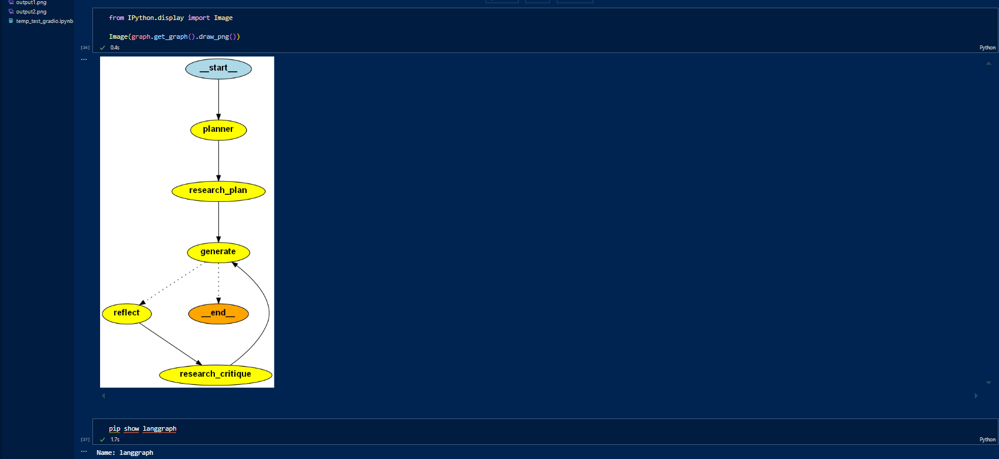
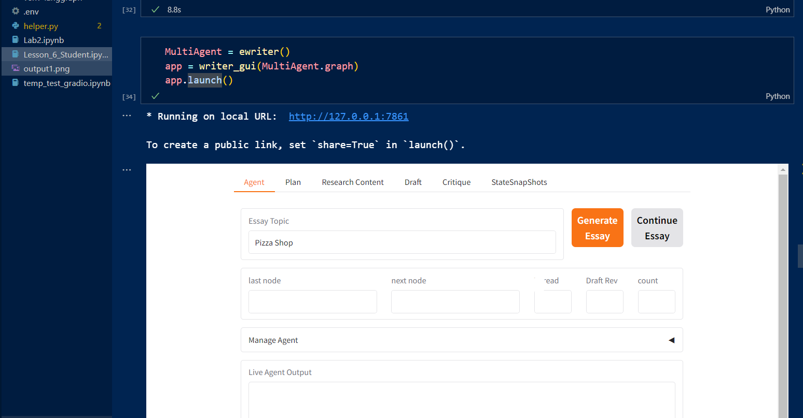

# Essay Writer Interface

This project provides an interface for generating essays using AI-based text generation techniques. It leverages `langgraph`, `langchain`, and environment variables for configuration.

## Features
- Utilizes `langgraph` for state-based processing.
- Implements AI-driven essay writing using `langchain`.
- Supports system, human, and AI-generated messages.
- Saves checkpoint data using SQLite and in-memory storage.

## Installation

1. Clone the repository:
   ```bash
   git clone <repository-url>
   cd <repository-folder>
   ```

2. Create and activate a virtual environment (optional but recommended):
   ```bash
   python -m venv venv
   source venv/bin/activate  # On Windows use: venv\Scripts\activate
   ```

3. Install dependencies:
   ```bash
   pip install -r requirements.txt
   ```

4. Set up environment variables:
   Create a `.env` file and add the necessary API keys or configurations as required.

## Usage

Run the Jupyter Notebook to interact with the Essay Writer Interface:
```bash
jupyter EssayWriter.ipynb
```

Or execute the script in a Python environment:
```python
python script.py
```

## Dependencies
- `langgraph`
- `langchain`
- `gradio`
- `pygraphviz`
- `dotenv`
- `sqlite`
- `typing`

## Screenshots
Here are some screenshots showcasing the interface and functionality:




## Contributing
Feel free to fork the repository, open issues, and submit pull requests.

## License
This project is licensed under the MIT License.

## Acknowledgments
Special thanks to the open-source community for providing powerful AI tools.

